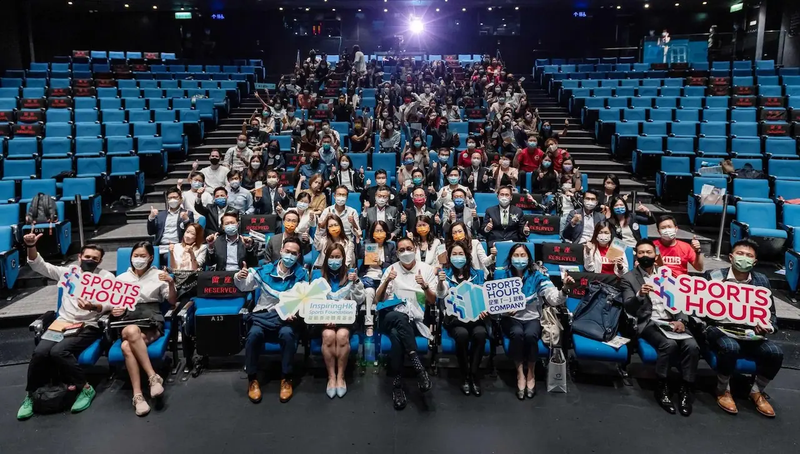

Take2 Health is honoured to receive the Inaugural SportsHour Company Scheme Award which is organised by the InspiringHK Sports Foundation.

To foster a healthy lifestyle as part of the company culture in which one of the benefits is improving business efficiency, the scheme encourages Hong Kong companies and organisations to advocate to employees and their family members to exercise daily for an hour or more in mid-to-high-intensity as recommended by the World Health Organization. Echoing this initiative, our company encourages all our employees, families and friends to exercise regularly to stay fit. Furthermore, we envision raising citizens’ well-being by advocating health awareness on many aspects, such as cancers.

To truly achieve our vision and serve, help and protect those we care for, we are determined to provide excellent services with pioneering early cancer detection technologies and supply actionable cancer-related information to safeguard the long-term health of all human beings.

